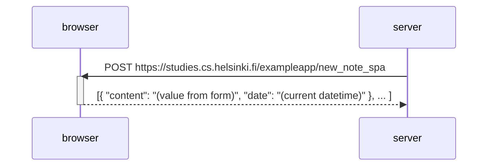

```mermaid
%% Single page app diagram
sequenceDiagram
    participant browser
    participant server

    %% a single POST request
    server->>browser: POST https://studies.cs.helsinki.fi/exampleapp/new_note_spa
    activate browser
    browser-->>server: [{ "content": "(value from form)", "date": "(current datetime)" }, ... ]
    deactivate browser

```
