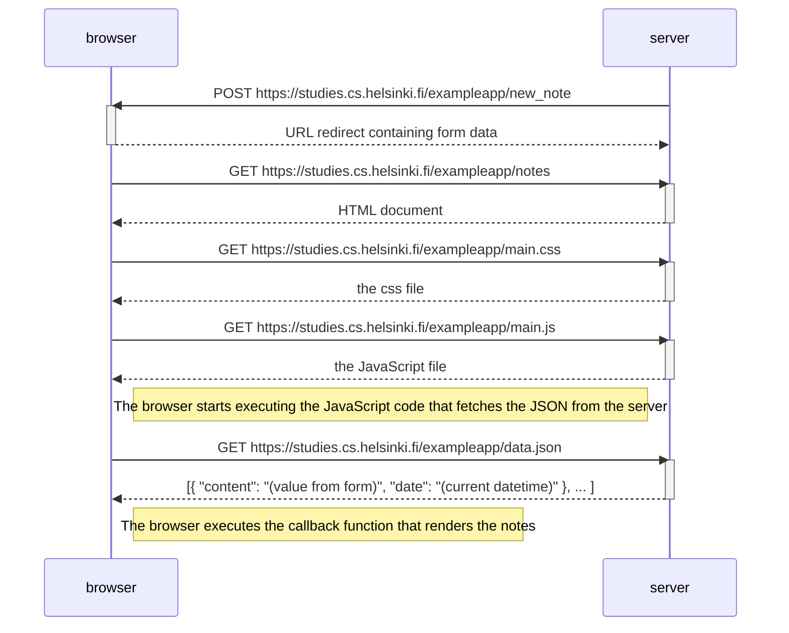

```mermaid
%% Added POST request from form submission
sequenceDiagram
    participant browser
    participant server

    %% POST request from form submission
    server->>browser: POST https://studies.cs.helsinki.fi/exampleapp/new_note
    activate browser
    browser-->>server: URL redirect containing form data
    deactivate browser

    browser->>server: GET https://studies.cs.helsinki.fi/exampleapp/notes
    activate server
    server-->>browser: HTML document
    deactivate server

    browser->>server: GET https://studies.cs.helsinki.fi/exampleapp/main.css
    activate server
    server-->>browser: the css file
    deactivate server

    browser->>server: GET https://studies.cs.helsinki.fi/exampleapp/main.js
    activate server
    server-->>browser: the JavaScript file
    deactivate server

    Note right of browser: The browser starts executing the JavaScript code that fetches the JSON from the server

    browser->>server: GET https://studies.cs.helsinki.fi/exampleapp/data.json
    activate server
    server-->>browser: [{ "content": "(value from form)", "date": "(current datetime)" }, ... ]
    deactivate server

    Note right of browser: The browser executes the callback function that renders the notes
```
